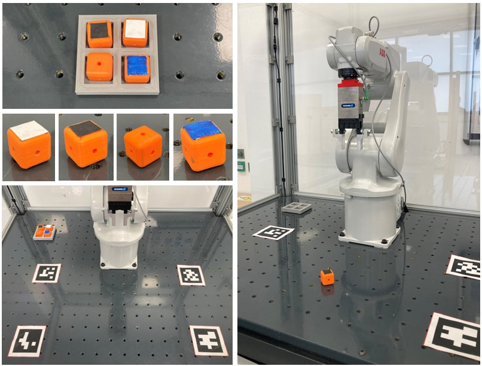

# irb120pe_bringup: Robot Bringup Package

<br />
<div align="center">
  <a>
    
  </a>

  <br />
</div>
<br />

<!-- INFORMATION -->
## ROS 2 Package Information

The Robot Bringup package establishes seamless communication between the ROS 2 system and the real robot arm, enabling comprehensive control over its motion and state:
- abb_ros2: For the ABB Robot - ROS 2 connection to be established properly, the ROS 2 PC and the ABB Robot Controller need to be connected on the same internet network (an ethernet-based connection has been used in this use-case). Apart from that, there is a "CONTROLLER SETUP" configuration step that needs to be done on the ABB Robot, that can be found [here](https://github.com/PickNikRobotics/abb_ros2/blob/rolling/docs/RobotStudioSetup.md#controller-configuration). Once the ABB Robot Controller is ready, the TRob1Main.mod module (RAPID script, provided in this folder) talks to ROS 2 through the ABB EGM interface. This module needs to be loaded to the robot's teach pendant. More detailed instructions and information can be found in PickNikRobotics' [abb_ros2](https://github.com/PickNikRobotics/abb_ros2) GitHub repository.
- Config: This folder contains the parameters and specifications of the ROS 2 controllers that manage the ABB Robot and interface with the ABB ROS 2 driver. 
- Launch: This folder contains the .launch.py script that launches all the ROS 2 nodes required to execute the ROS 2 - ABB Robot connection + MoveIt!2 Control pipeline. In addition, it executes the custom /Move, /RobMove and /RobPose ROS 2 nodes required to manipulate the robot. For more information about these custom robot movements, please do visit the [ros2_SimRealRobotControl](https://github.com/IFRA-Cranfield/ros2_SimRealRobotControl/tree/humble/ros2srrc_execution) repository.

<!-- Execution -->
## Execution

The Robot Bringup + MoveIt!2 control pipeline of the ABB IRB-120 robot for this application can be executed with the following command, __straight after having executed the TRob1Main program in the ABB Robot's teach pendant__:
```sh
ros2 launch irb120pe_bringup bringup.launch.py ip_address:=0.0.0.0
```
