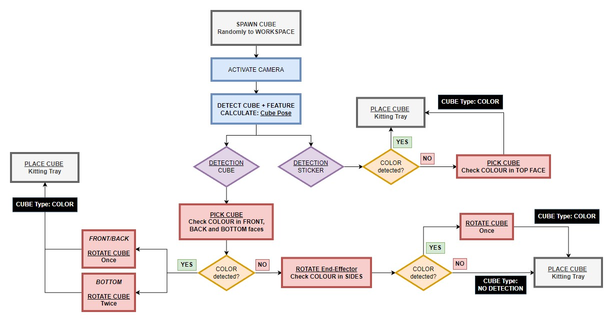

# irb120pe_detection: Cube Detection and Pick-and-Place

<!-- INFORMATION -->
## ROS 2 Package Information

The Detection package integrates YOLOv8 and OpenCV modules for robust cube detection, pose estimation, and coordination of robot movements for the cube pick-and-place task. The source code has been developed using Python, and it has been divided into different modules for a better understanding and a simpler integration within the ROS 2 framework:

__robot.py__

The robot.py script executes robot movements through two distinct classes. These classes utilize ROS2 Actions to command the robot:

- The /Robmove class enables the user to move the robot to a specific end-effector pose.
- The /Move class allows the user to execute various specific robot movements, including Cartesian-Space, Joint-Space, Single Joint, or Rotation, by interacting with the /Move ROS2 Action.

__gripper.py - gripper_Gz.py__

The gripper.py and gripper_Gz.py scripts control the Schunk EGP-64 parallel gripper for different environments:

- gripper.py: This script is designed to interact with the gripper in a real ABB robot environment. It controls the gripper by utilizing the Robot Controller's I/Os, enabling manipulation tasks in the physical world.

- gripper_Gz.py: Conversely, this script is tailored for Gazebo simulation. It operates the gripper by calling the /Move (MoveG) ROS2 action, allowing manipulation tasks to be simulated within the Gazebo environment.

__detection.py__

The detection.py script encapsulates Python classes responsible for cube detection and manipulation tasks. It employs YOLOv8 for cube detection and classification, OpenCV for pose estimation, and interfaces to obtain camera frames from both a real web camera and Gazebo simulation. These functionalities enable the script to detect cubes, estimate their poses, and interact with camera feeds from both real-world and simulated environments, facilitating comprehensive testing and deployment of robotic manipulation tasks.

__waypoints.py - routines.py__

The waypoints.py script serves as a repository for storing the parameters of all the waypoints essential for executing movements within the robotic task, as facilitated by the robot.py script. Each waypoint contains specific information defining the desired end-effector poses or configurations required to accomplish the task effectively.

On the other hand, the routines.py script encapsulates the waypoints stored in waypoints.py as sequences within Python functions. These functions represent predefined routines or sequences of movements required to complete various aspects of the task. The main script in the program invokes these routines, orchestrating the operation of the robot for the application. By structuring the waypoints as functions within routines.py, the script enhances code organization and readability, simplifying the execution of complex robotic tasks.

__spawn.py__

The spawn.py script is designed to facilitate the random spawning of cubes within the Gazebo simulation environment. Its primary purpose is to support the testing of the cube detection, pick-and-place application by generating randomized scenarios for evaluation. By programmatically spawning cubes at random positions and orientations within the simulation environment, the script enables comprehensive testing of the application's capabilities under diverse conditions. This functionality ensures robustness and reliability in the detection and manipulation of cubes, contributing to the refinement and optimization of the robotic application's performance.

__samples.py__

The samples.py script serves the purpose of capturing and storing images used in the training of a custom YOLOv8 model for cube detection. It functions by randomly spawning cubes within the workspace environment and capturing images of these cubes for training purposes. By systematically generating a diverse set of sample images, the script facilitates the training process, enabling the YOLOv8 model to accurately detect and classify cubes within the environment. 

The script can be executed with the following command:
```sh
ros2 run irb120pe_detection samples.py
```

__visualize_YOLO.py__

The visualize_YOLO.py script serves the purpose of providing real-time visualization of the output generated by the YOLOv8 detection model. By continuously displaying the detection results, this script enables users to promptly verify the accuracy of the YOLOv8 model in detecting and classifying cubes. This functionality is invaluable for both simulation and real-world scenarios, allowing users to assess the performance of the model in diverse environments. With this real-time feedback, developers can iteratively refine and optimize the YOLOv8 model, ensuring robust and reliable cube detection across different conditions.

The script can be executed with the following command:
```sh
# For Gazebo Simulation:
ros2 run irb120pe_detection visualize_YOLO.py --ros-args -p ENVIRONMENT:="GAZEBO"
# For the Real ABB Cell:
ros2 run irb120pe_detection visualize_YOLO.py --ros-args -p ENVIRONMENT:="ROBOT"
```

__main.py - main_Gz.py - main_GzSimplified.py__

The main script acts as the central orchestrator, integrating the functionalities of the robot, gripper, detection, and routines scripts described above. Its primary role is to coordinate the entire cube detection, classification, pose estimation, and pick-and-place task. By leveraging the capabilities of the individual scripts, main.py manages the execution flow, orchestrating the interaction between the robot, gripper, and detection modules. This integration enables seamless coordination of various tasks, including cube detection, classification, pose estimation, and manipulation, ensuring the efficient and reliable execution of the pick-and-place operation.

The script can be executed with the following command:
```sh
# For the execution in the real ABB Cell:
ros2 run irb120pe_detection main.py 
# For the execution in Gazebo Simulation:
ros2 run irb120pe_detection main_Gz.py
# For the execution in Gazebo Simulation of a simplified program that obtains the robot pose directly from Gazebo, without triggering YOLOv8 and OpenCV modules:
ros2 run irb120pe_detection main_GzSimplified.py 
```

<!-- Program Logic -->
## Program Logic

The execution process unfolds as follows (see picture below): Initially, the cube is randomly spawned within the grid defined by ArUco markers. Upon activation of the camera, the YOLOv8 model classifies the cube into two classes: cube or sticker. In the case of a sticker classification, indicating the presence of a colored feature atop the cube, the robot assesses whether the color type is discernible. If so, the relevant information is relayed to the robot, and the cube is placed in its corresponding slot on the kitting tray. In instances where color identification is challenging, the robot optimizes detection by moving the cube closer to the camera before proceeding with placement. For cubes classified as cube, denoting an unknown feature location, the robot initiates a systematic check of the front, back, and bottom sides. Successful detection prompts rotation for optimal feature visibility, culminating in placement on the kitting tray. Unsuccessful detection prompts a 90-degree rotation for examination of side faces. Subsequent successful detection results in final placement, while repeated failure leads to placement in the designated "no detections" slot on the kitting tray. This adaptive and thorough process ensures accurate classification and effective placement of cubes with diverse feature configurations. 

<br />
<div align="center">
  <a>
    
  </a>

  <br />
</div>
<br />