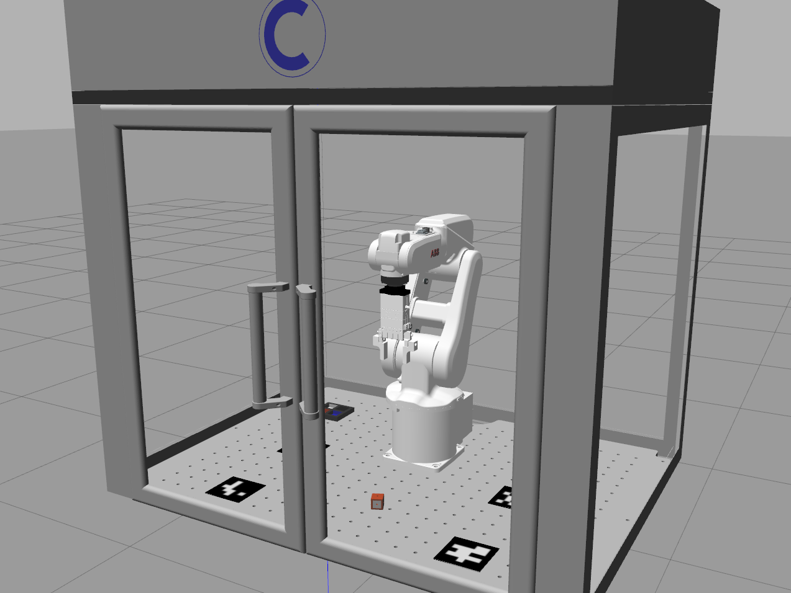

# irb120pe_gazebo: Gazebo Simulation Package

<br />
<div align="center">
  <a>
    
  </a>

  <br />
</div>
<br />

<!-- INFORMATION -->
## ROS 2 Package Information

The Gazebo package provides essential resources for simulating and testing the behavior of the ABB IRB-120 industrial robot within the Gazebo environment:
- Config: This folder contains the parameters and specifications of the ROS 2 controllers that manage the ABB Robot.
- Launch: This folder contains the .launch.py script that launches all the ROS 2 nodes required to execute the simulation.
- Meshes: CAD files (ABB Robot, Schunk Gripper, Cell Enclosure, Cubes, Tray).
- Urdf: Robot specifications, formatted on the URDF format (ROS 2 standard).
- Worlds: Gazebo .world file, containing information about the simulation environment.

<!-- Execution -->
## Execution

The Simulation Environment of the ABB IRB-120 enclosure for this application (visualization, without ROS 2 nodes for the control of the robot) can be executed with the following command:
```sh
ros2 launch irb120pe_gazebo simulation.launch.py
```