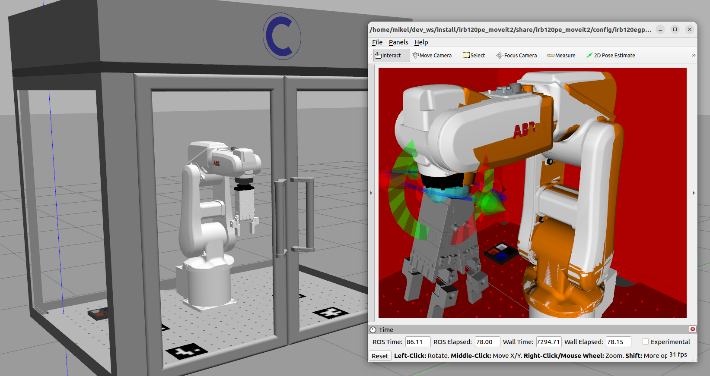

# irb120pe_moveit2: MoveIt!2 Sim+Control Package

<br />
<div align="center">
  <a>
    
  </a>

  <br />
</div>
<br />

<!-- INFORMATION -->
## ROS 2 Package Information

The MoveIt!2 package facilitates motion planning and execution for the ABB IRB-120 industrial robot, providing essential information and interfaces for controlling its movements:
- Config: This folder contains the parameters and specifications of the ROS 2 controllers that manage the ABB Robot and interface with MoveIt!2, and the SRDF and RVIZ files required by MoveIt!2 to compute the kinematic calculations. 
- Launch: This folder contains the .launch.py script that launches all the ROS 2 nodes required to execute the Gazebo simulation + MoveIt!2 Control pipeline. In addition, it executes the custom /Move, /RobMove and /RobPose ROS 2 nodes required to manipulate the robot. For more information about these custom robot movements, please do visit the [ros2_SimRealRobotControl](https://github.com/IFRA-Cranfield/ros2_SimRealRobotControl/tree/humble/ros2srrc_execution) repository.

<!-- Execution -->
## Execution

The Gazebo+MoveIt!2 Simulation and Control Environment of the ABB IRB-120 enclosure for this application can be executed with the following command:
```sh
ros2 launch irb120pe_moveit2 moveit2.launch.py
```

